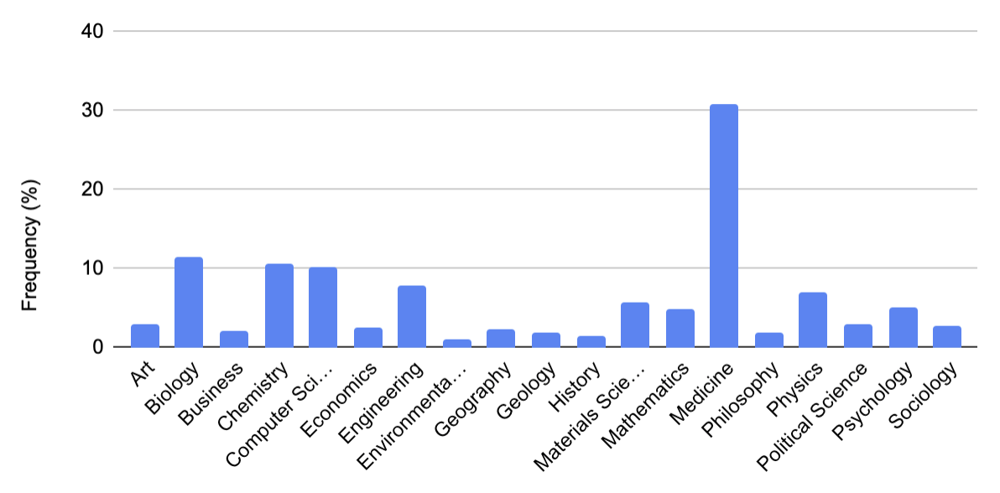
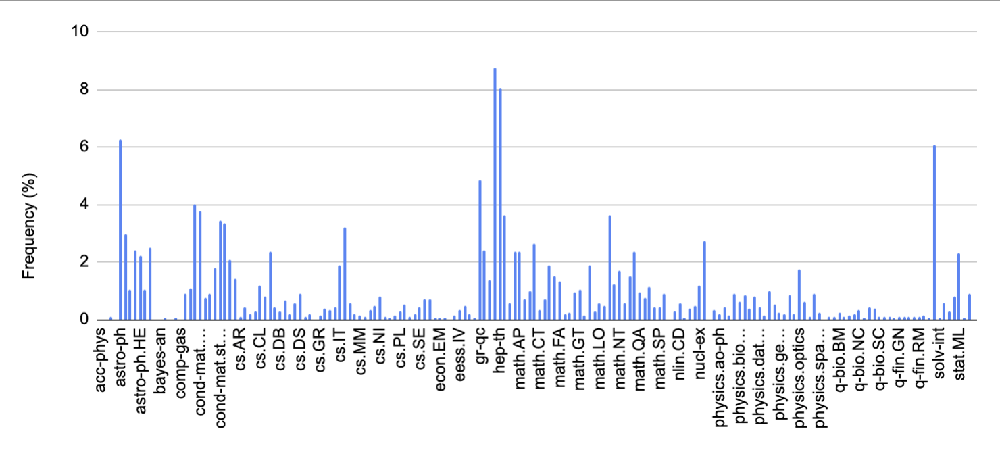
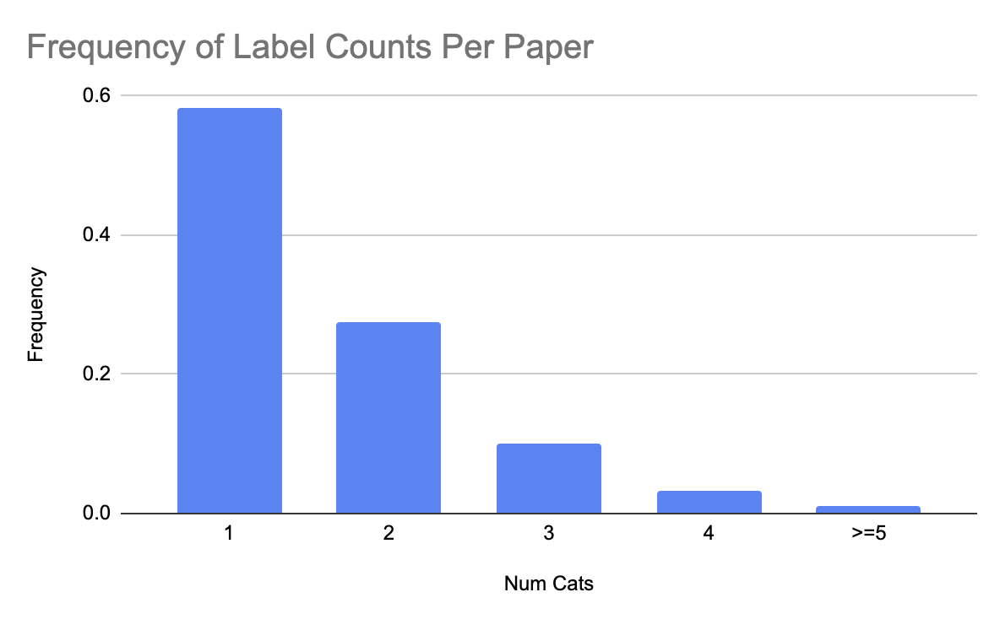

# Background and Objectives
Semantic Scholar (www.semanticscholar.org) is an academic literature
search engine and knowledge graph, and my place of employment.

Recently our researchers have developed a model for generating dense
(768d-)vector representations of papers, based on title and abstract text [1].

As outlined in the paper, these vectors are produced with a transformer-based
approach, trained against a co-citation based objective.

This model has been operationalized at scale over the ~200M S2 corpus, and
the embeddings are being employed in a variety of downstream tasks.

In this project, I attempt to use these embeddings as input into multiclass
and multilabel classification networks. The first effort is in partly reproducing
the work of [1], by predicting Microsoft Academic Graph topics; the latter two
experiments are focused on the harder task of more granular ArXiv category
prediction.

Due to the proprietary nature of the underlying data used in this project,
the datasets and code I used to generate them are withheld from this repository.
The modeling, evaluation, and driver code, however, is available for review herein.

# MAG Field of Study Multi-label Classification
Through partnership with Microsoft Academic Graph (MAG), Semantic Scholar
receives MAG topic classification data for academic papers. These are high-level
subject areas, such as "Biology", "Computer Science", etc.

Prior work [1] indicates a strong ability to recover these topics from S2's
paper embeddings. As this is a strictly simpler task than determining ArXiv
subject area (due to coarser granularity of the classes, and the much smaller
number of them), I decided to try repeating the results of [1]. This would serve
as a sanity test for modeling decisions, and establish a likely ceiling on results
I might achieve for the granular ArXiv categories.

### Dataset Construction and Data Distribution

A dataset of 250k papers was generated by random sampling from Semantic
Scholar's ~200M paper corpus. Sampling was restricted to papers
for which abstract text was available, as the paper embeddings generated from
just title text are not as useful. These examples were then split between 
training:eval:test at 200k:25k:25k.

There are 19 MAG topic classes in all, the frequencies in the dataset of which
can be seen in the figure below. 
(Please note that as multiple labels are possible,
this is not a probability distribution [though most papers have <= 2 topics]).

Class frequencies are very uneven in this dataset; no attempt to alter
this distribution was made.

### Network Architecture

Because the input to this model is a dense vector representation of a paper,
and the task is simple multilabel classification, a correspondingly simple architecture
was chosen.

These networks are a series of ReLU-activated fully-connected layers,
terminating in a sigmoid-activated final dense layer with dimensionality equivalent
to the number of classes (19). This output vector represents the independent probabilities
of each class label. The basic implementation of this network can be seen in [TODO: insert link].

### Training Regime

Topic labels were encoded as multi-hot binary vectors for each paper,
and the network was trained with binary crossentropy loss across all
labels.

In order to evaluate performance for this task, an implementation of
mean IOU was coded up based on set arithmetic of the predicted and
actual classes (see: TODO INSERT LINK). A threshold for positive prediction
was set to 0.5 in this metric.

IOU was chosen due to the poor fit of the default binary crossentropy definition 
of accuracy. This fit was poor due to the sparsity of the label vectors 
(>99% of papers belong to two or fewer fields of study), which had the effect
of generating misleadingly optimistic results. IOU seemed to strike a 
reasonable balance between notions of precision and recall in the sparse
multilabel context.

### Results

This dataset was highly sensitive to learning rate and regularization. Overly
expressive/large models did not show notable value over terse models. Ultimately,
a model of the following hyperparameters proved best on the evaluation set:

* Num hidden units = 512
* Num hidden layers = 2
* L2 Kernel regularization = 0.0005
* Learning rate = 0.0001

Its performance on the test set was:

| Set   | Mean IOU  |
|:-----:|:---------:| 
| Train | 0.5957 |
| Eval  | 0.5811 |
| Test  | 0.5791 |

# ArXiv Category Multi-label Classification

The key objective of this work was to extend on the demonstrated ability
to recover MAG topics from S2's paper embeddings, and to determine whether 
are rich enough to allow for determination of more granular paper subject area.

To this end, I leverage the comprehensively categorized academic papers pre-published
to [ArXiv](https://arxiv.org/category_taxonomy). These are categorized to granularities
such as "Artificial Intelligence", "Game Theory", "Solar and Stellar Astrophysics", etc.

### Dataset Construction and Distribution

As with the MAG dataset, papers were randomly sampled from Semantic Scholar's corpus, 
though limited this time to the ~1.7M papers from ArXiv. In total, 450k papers were sampled,
being split to train:eval:test sets of 400k:25k:25k.

Class frequencies are even more dramatically uneven than MAG topics, as seen in the figure
below:

Although elided along the x-axis, there are a total of 176 classes, approximately
10-fold MAG's topics. Multiple labels also occur on individual papers with much higher
frequency in this dataset:

### Network Architecture
Identical to the MAG topic classifier in the first section.

### Training Regime
Likewise, binary crossentropy was re-used as loss with an IOU
implementation as a performance metric.

### Results

| Set   | Mean IOU  |
|:-----:|:---------:| 
| Train | 0.5608 |
| Eval  | 0.5481 |
| Test  | 0.5478 |

# ArXiV Category Primary Label Classification

ArXiv papers are labeled with multiple categories with high frequency,
but each has a "primary" label. Additional labels are considered secondary.

To conclude these experiments, I decided to see how well primary ArXiv category could be
predicted from a paper's embedding.

### Dataset Construction

The dataset from the previous section was reused, but the multi-hot label vectors
were replaced with single-hot vectors marking the "primary" category.

### Network and Training Objective

A similar model was used to the prior two experiments, but because this a single
classification task, rather than a multi-label task, the final layers were modified.

Specifically, the sigmoid-activated final dense layer was replaced with a softmax-activated
dense layer. Loss during training was switched to categorical crossentropy, and the
performance metric was changed to simple classification accuracy. This is implemented
in [TODO: link to multiclass_single_label.py].

### Results

As before, various hyperparameterizations were tried. The model with the single best
eval set results was chosen for a run against the withheld test set. The accuracy
results are seen below:

| Set   | Accuracy |
|:-----:|:---------:| 
| Train | 67.59% |
| Eval  | 62.27% |
| Test  | 62.71% |

# References

[1] Cohan, A., Feldman, S., Beltagy, I., Downey, D., & Weld, D.S. (2020). SPECTER: Document-level Representation Learning using Citation-informed Transformers. ArXiv, abs/2004.07180.

